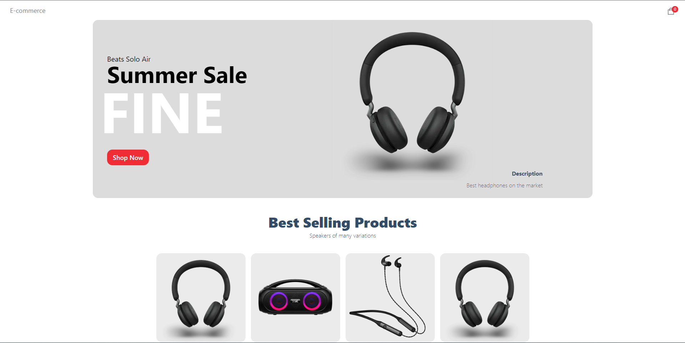

# E-commerce

This is an e-commerce project created using [Next.js](https://nextjs.org/). 

## Used Technologies

- React
- Next.js
- Sanity
- Stripe

## Features

- Add products and banners with Sanity dashboard.
- Add products to shopping cart.
- Pay with Stripe (Since Stripe is not available in Turkey, it is not yet fully implemented).
